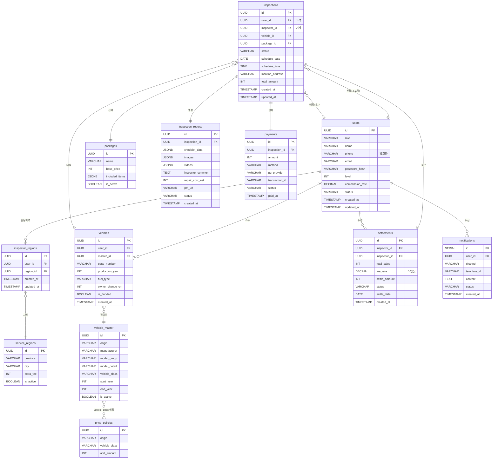

# 니어카 데이터베이스 ERD (Entity Relationship Diagram)

본 문서는 니어카 V1 통합 웹 시스템의 데이터베이스 개체 관계 다이어그램을 정의합니다.

## 1. 개요

- **데이터베이스**: PostgreSQL 15+
- **총 테이블 수**: 10개 핵심 테이블
- **정규화 수준**: 제3정규형(3NF)
- **Primary Key**: UUID 타입 사용 (확장성 및 보안 고려)

## 2. 핵심 엔티티 및 속성

### 2.1 사용자 관리 엔티티

#### users (사용자 통합 테이블)
- **역할**: 고객(Client), 진단기사(Inspector), 내부직원(Staff), 운영자(Admin) 통합 관리
- **주요 속성**:
  - `id` (UUID, PK): 사용자 고유 식별자
  - `role` (VARCHAR(20)): 사용자 역할 (client, inspector, staff, admin)
  - `name` (VARCHAR(100)): 이름
  - `phone` (VARCHAR(256)): 휴대폰 번호 (AES-256 암호화 저장)
  - `email` (VARCHAR(100)): 이메일 (선택 사항)
  - `password_hash` (VARCHAR(256)): 비밀번호 해시 (비회원은 NULL)
  - `level` (INT): 기사 등급 (1~5, 기사 전용)
  - `commission_rate` (DECIMAL(5,2)): 기사 수수료율 (예: 0.70, 기사 전용)
  - `status` (VARCHAR(20)): 계정 상태 (active, inactive, suspended)
  - `created_at`, `updated_at` (TIMESTAMP): 생성일/수정일

#### inspector_regions (기사 활동 지역)
- **역할**: 기사와 활동 지역의 다대다 관계 매핑
- **주요 속성**:
  - `id` (UUID, PK): 매핑 ID
  - `user_id` (UUID, FK): 기사 ID (users 참조)
  - `region_id` (UUID, FK): 활동 지역 ID (service_regions 참조)
  - `created_at`, `updated_at` (TIMESTAMP): 생성일/수정일
  - UNIQUE 제약: (user_id, region_id)

#### service_regions (서비스 지역)
- **역할**: 지역별 출장비 할증 관리
- **주요 속성**:
  - `id` (UUID, PK): 지역 ID
  - `province` (VARCHAR(50)): 도/광역시 (예: 서울, 경기)
  - `city` (VARCHAR(50)): 시/구 (예: 강남구, 분당구)
  - `extra_fee` (INT): 지역 할증 요금
  - `is_active` (BOOLEAN): 서비스 가능 여부

**관계**: 
- `users.id` ← `inspector_regions.user_id` → `inspector_regions.region_id` → `service_regions.id` (다대다, 기사 활동 지역)

### 2.2 차량 관리 엔티티

#### vehicle_master (차량 마스터 데이터)
- **역할**: 필터링 및 견적 산출의 기준이 되는 제조사/모델 계층 데이터
- **주요 속성**:
  - `id` (UUID, PK): 마스터 ID
  - `origin` (VARCHAR(20)): 제조국 구분 (domestic, imported)
  - `manufacturer` (VARCHAR(50)): 제조사 (현대, BMW 등)
  - `model_group` (VARCHAR(100)): 모델명 (그랜저, 5시리즈)
  - `model_detail` (VARCHAR(100)): 상세 모델 (더 뉴 그랜저 IG)
  - `vehicle_class` (VARCHAR(20)): 차량 등급 (compact, mid, large, suv, supercar...)
  - `start_year` (INT): 출시 연도
  - `end_year` (INT): 단종 연도 (생산 중이면 NULL)
  - `is_active` (BOOLEAN): 사용 여부

#### vehicles (등록 차량)
- **역할**: 고객이 진단을 요청한 개별 차량 정보
- **주요 속성**:
  - `id` (UUID, PK): 차량 ID
  - `user_id` (UUID, FK): 소유주 ID (users 참조)
  - `master_id` (UUID, FK): 마스터 데이터 ID (vehicle_master 참조)
  - `plate_number` (VARCHAR(20)): 차량 번호
  - `production_year` (INT): 연식
  - `fuel_type` (VARCHAR(20)): 연료 타입 (gasoline, diesel, electric...)
  - `owner_change_cnt` (INT): 소유자 변경 횟수
  - `is_flooded` (BOOLEAN): 침수 여부 (Car365 조회 결과)
  - `created_at` (TIMESTAMP): 생성일

**관계**:
- `users.id` → `vehicles.user_id` (1:N, 사용자-차량)
- `vehicle_master.id` → `vehicles.master_id` (1:N, 마스터-차량)

#### price_policies (가격 정책)
- **역할**: 차량 등급(Class)에 따른 추가 요금 정책
- **주요 속성**:
  - `id` (UUID, PK): 정책 ID
  - `origin` (VARCHAR(20)): 국산/수입 구분 (domestic, imported)
  - `vehicle_class` (VARCHAR(20)): 차량 등급 (vehicle_master.vehicle_class와 매핑)
  - `add_amount` (INT): 추가 요금

**관계**:
- 논리적 관계: `vehicle_master.vehicle_class` ↔ `price_policies.vehicle_class` (비즈니스 로직 매핑)

### 2.3 진단 프로세스 엔티티

#### packages (진단 패키지)
- **역할**: 진단 패키지 관리
- **주요 속성**:
  - `id` (UUID, PK): 패키지 ID
  - `name` (VARCHAR(50)): 패키지명 (풀패키지, 라이트A 등)
  - `base_price` (INT): 기본 가격
  - `included_items` (JSONB): 포함 항목 리스트
  - `is_active` (BOOLEAN): 판매 여부

#### inspections (진단 신청)
- **역할**: 진단 신청 정보 및 상태 관리
- **주요 속성**:
  - `id` (UUID, PK): 신청 ID
  - `user_id` (UUID, FK): 고객 ID (users 참조)
  - `inspector_id` (UUID, FK): 배정 기사 ID (users 참조, NULL 가능)
  - `vehicle_id` (UUID, FK): 차량 ID (vehicles 참조)
  - `package_id` (UUID, FK): 패키지 ID (packages 참조)
  - `status` (VARCHAR(20)): 진행 상태 (requested, assigned, report_submitted, sent, cancelled)
  - `schedule_date` (DATE): 예약 날짜
  - `schedule_time` (TIME): 예약 시간
  - `location_address` (VARCHAR(255)): 진단 장소
  - `total_amount` (INT): 최종 결제 금액 (패키지+차종할증+지역할증 합계)
  - `created_at`, `updated_at` (TIMESTAMP): 생성일/수정일

**관계**:
- `users.id` → `inspections.user_id` (1:N, 고객-신청)
- `users.id` → `inspections.inspector_id` (1:N, 기사-배정)
- `vehicles.id` → `inspections.vehicle_id` (1:N, 차량-신청)
- `packages.id` → `inspections.package_id` (1:N, 패키지-신청)
- `service_regions.id` → `inspections.region_id` (논리적 관계, 지역별 할증)

#### inspection_reports (진단 레포트)
- **역할**: 진단 결과 및 레포트 정보
- **주요 속성**:
  - `id` (UUID, PK): 레포트 ID
  - `inspection_id` (UUID, FK): 신청 ID (inspections 참조)
  - `checklist_data` (JSONB): 체크리스트 결과 ({"engine": "good", "tire": "warn"})
  - `images` (JSONB): 사진 URL 리스트 ([{"section": "front", "url": "..."}])
  - `videos` (JSONB): 영상 URL 리스트
  - `inspector_comment` (TEXT): 종합 의견
  - `repair_cost_est` (INT): 예상 수리비
  - `pdf_url` (VARCHAR(255)): PDF 파일 경로 (S3 URL)
  - `status` (VARCHAR(20)): 레포트 상태 (submitted, reviewed)
  - `created_at` (TIMESTAMP): 생성일

**관계**:
- `inspections.id` → `inspection_reports.inspection_id` (1:1, 신청-레포트)

### 2.4 결제 및 정산 엔티티

#### payments (결제)
- **역할**: 결제 정보 관리
- **주요 속성**:
  - `id` (UUID, PK): 결제 ID
  - `inspection_id` (UUID, FK): 신청 ID (inspections 참조)
  - `amount` (INT): 결제 금액
  - `method` (VARCHAR(20)): 결제 수단 (card, bank_transfer 등)
  - `pg_provider` (VARCHAR(20)): PG사 (toss, iamport 등)
  - `transaction_id` (VARCHAR(100)): 거래 고유 번호
  - `status` (VARCHAR(20)): 상태 (pending, paid, cancelled, refunded)
  - `paid_at` (TIMESTAMP): 결제 완료일

**관계**:
- `inspections.id` → `payments.inspection_id` (1:1, 신청-결제)

#### settlements (정산)
- **역할**: 기사 정산 내역 관리
- **주요 속성**:
  - `id` (UUID, PK): 정산 ID
  - `inspector_id` (UUID, FK): 기사 ID (users 참조)
  - `inspection_id` (UUID, FK): 관련 진단 건 ID (inspections 참조)
  - `total_sales` (INT): 해당 건 매출액
  - `fee_rate` (DECIMAL(5,2)): 적용 수수료율 (스냅샷 저장)
  - `settle_amount` (INT): 지급 예정액
  - `status` (VARCHAR(20)): 정산 상태 (pending, completed)
  - `settle_date` (DATE): 정산 기준일
  - `created_at` (TIMESTAMP): 생성일

**관계**:
- `users.id` → `settlements.inspector_id` (1:N, 기사-정산)
- `inspections.id` → `settlements.inspection_id` (1:1, 신청-정산)

#### notifications (알림)
- **역할**: 알림 발송 이력 관리
- **주요 속성**:
  - `id` (SERIAL, PK): 알림 ID
  - `user_id` (UUID, FK): 수신자 ID (users 참조)
  - `channel` (VARCHAR(20)): 채널 (alimtalk, sms, email)
  - `template_id` (VARCHAR(50)): 템플릿 코드
  - `content` (TEXT): 발송 내용
  - `status` (VARCHAR(20)): 상태 (pending, sent, failed)
  - `created_at` (TIMESTAMP): 발송 시간

**관계**:
- `users.id` → `notifications.user_id` (1:N, 사용자-알림)

## 3. 엔티티 관계 다이어그램 (ERD)

### 3.1 관계 요약

```
users (1) ──< (N) vehicles
users (1) ──< (N) inspections (as client)
users (1) ──< (N) inspections (as inspector)
users (1) ──< (N) settlements
users (1) ──< (N) notifications

users (1) ──< (N) inspector_regions ──> (N) service_regions (기사 활동 지역, 다대다)

vehicle_master (1) ──< (N) vehicles
vehicle_master.vehicle_class ── (logical) ── price_policies.vehicle_class

packages (1) ──< (N) inspections

inspections (1) ── (1) inspection_reports
inspections (1) ── (1) payments
inspections (1) ── (1) settlements
```

### 3.2 Mermaid ERD 다이어그램



## 4. 정규화 분석

### 4.1 제1정규형(1NF)
- 모든 테이블의 컬럼은 원자값(Atomic Value)을 가짐
- 중복 그룹 없음

### 4.2 제2정규형(2NF)
- 모든 비주요 속성이 기본키에 완전 함수 종속
- `users` 테이블: `level`, `commission_rate`는 `id`에 종속 (role에 종속이 아님)
- `inspections` 테이블: 모든 속성이 `id`에 완전 종속

### 4.3 제3정규형(3NF)
- 이행적 종속성 제거
- `vehicle_master`와 `vehicles` 분리: 차량 마스터 정보 중복 방지
- `price_policies` 분리: 가격 정책 변경 시 영향 최소화
- `settlements.fee_rate` 스냅샷 저장: 정산 시점의 수수료율 보존

## 5. JSONB 필드 구조 설계

### 5.1 packages.included_items
```json
{
  "sections": [
    {
      "name": "외관",
      "items": ["전면 유리", "운전석 도어", "후면 범퍼"]
    },
    {
      "name": "엔진룸",
      "items": ["엔진 오일", "냉각수", "배터리"]
    }
  ]
}
```

### 5.2 inspection_reports.checklist_data
```json
{
  "exterior": {
    "front_glass": {"status": "good", "note": ""},
    "driver_door": {"status": "warn", "note": "미세 스크래치"}
  },
  "engine": {
    "engine_oil": {"status": "good", "note": ""},
    "coolant": {"status": "warn", "note": "오염"}
  }
}
```

### 5.3 inspection_reports.images
```json
[
  {
    "section": "exterior",
    "item": "front_glass",
    "url": "https://s3.../img1.jpg",
    "thumbnail_url": "https://s3.../thumb1.jpg",
    "uploaded_at": "2025-12-07T10:30:00Z"
  }
]
```

## 6. 개인정보 암호화 대상 필드

### 6.1 암호화 대상
- **users.phone**: 휴대폰 번호 (AES-256 암호화)
- **users.email**: 이메일 (선택적 암호화, 개인정보보호법 준수)

### 6.2 암호화 방식
- **알고리즘**: AES-256-GCM
- **키 관리**: 환경변수 또는 AWS KMS
- **암호화 레벨**: 애플리케이션 레벨 (DB 저장 전 암호화)

## 7. 설계 원칙

### 7.1 확장성
- UUID 사용으로 분산 환경 대응
- JSONB 활용으로 스키마 변경 최소화

### 7.2 데이터 무결성
- 외래키 제약조건으로 참조 무결성 보장
- CHECK 제약조건으로 도메인 제약 강제

### 7.3 성능
- 주요 조회 필드에 인덱스 설계
- JSONB 필드에 GIN 인덱스 적용

### 7.4 보안
- 개인정보 암호화 저장
- 역할 기반 접근 제어 (애플리케이션 레벨)

## 8. 다음 단계

이 ERD 설계를 기반으로 다음 작업을 진행합니다:
1. 테이블 생성 SQL 스크립트 작성
2. 제약조건 설정
3. 인덱스 설계 및 구현
4. 초기 데이터 마이그레이션 스크립트 작성

